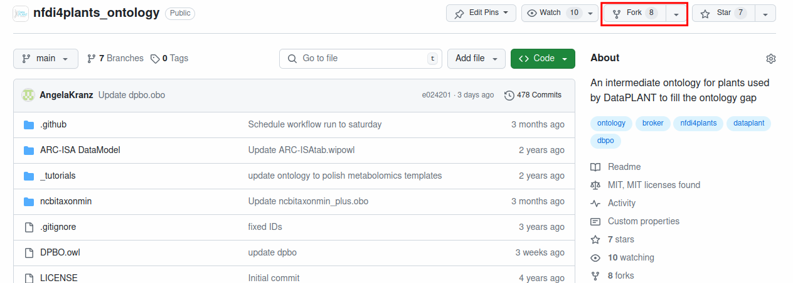
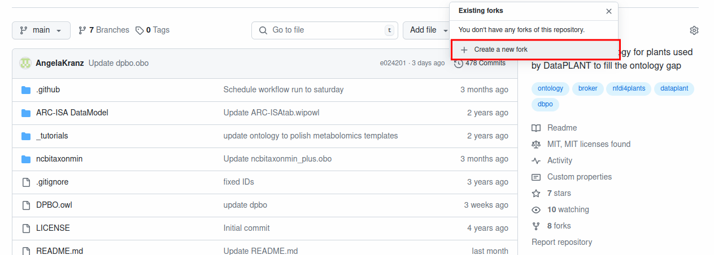
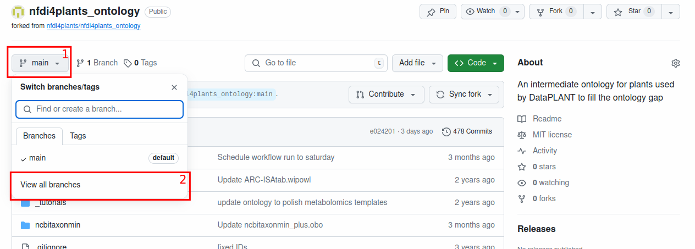
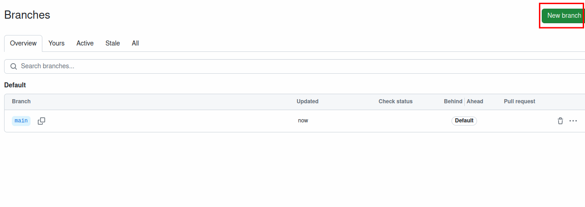
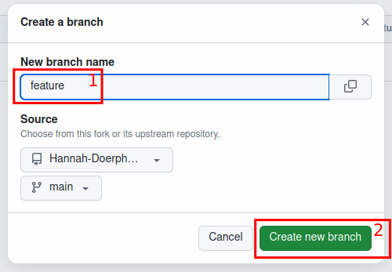
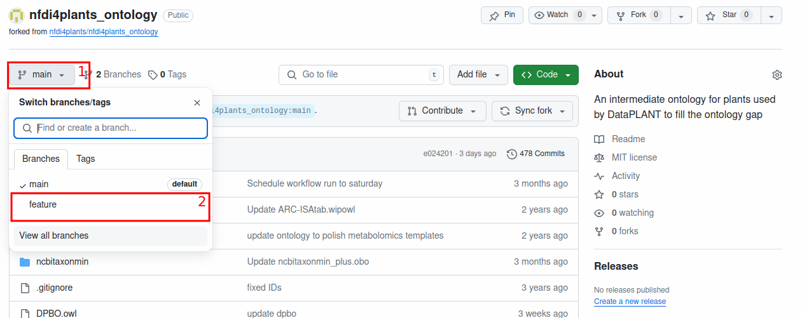
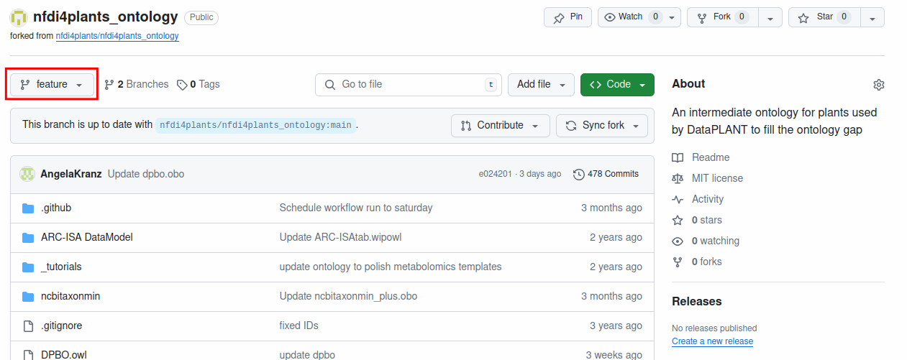
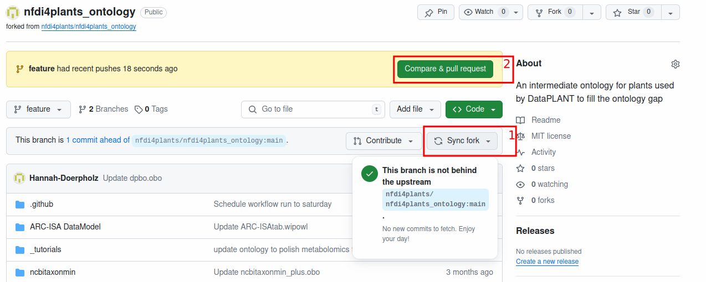
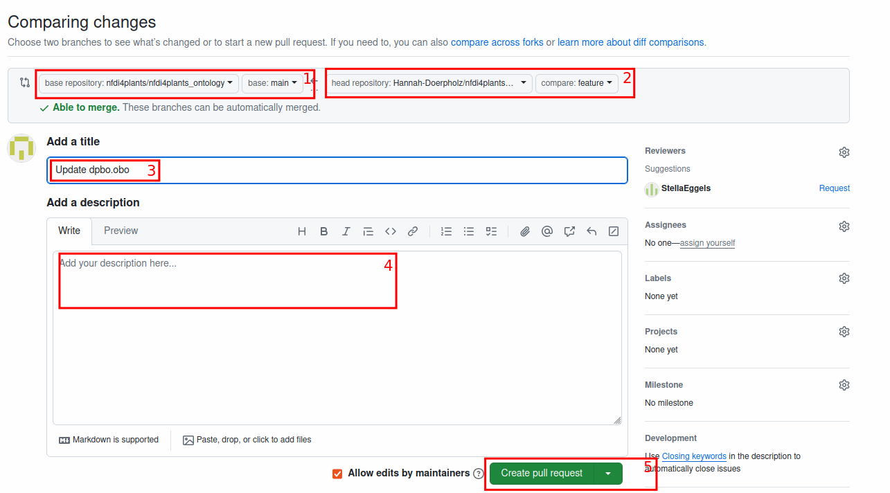

# DPBO 

With the  DataPLANT biology ontology (DPBO), DataPLANT provides an intermediate ontology that acts as a broker and bridge between the individual researcher/domain experts and main ontology providers.  
You can visualize the class tree of the DPBO and browse for terms at the TIB terminology service with the following link: https://terminology.tib.eu/ts/ontologies/dpbo/terms .

DPBO enables easy and agile collection of missing vocabulary as well as relationships between terms for (meta)data annotation using DataPLANT’s Swate tool. 

> [!Note] 
> DPBO formerly had the namespace NFDI4PSO, which is now obsolete. Old NFDI4PSO terms correspond to the DPBO term with the same accession number. For example, NFDI4PSO:0000011 (obsolete) corresponds to the term DPBO:0000011.

# Your contribution

We welcome every contribution! If a specific term, relationship or an existing external ontology needed for annotating your data with Swate is missing from the DataPLANT database, you can open an issue. We provide a variety of issue templates depending on your wishes: 

- **Add new term:** Suggest a new term to be added to DPBO
- **Import term:** Suggest a term to import from a registered ontology into DPBO
- **Import ontology:** Request the import of an already existing ontology into the SwateDB if you need >60% of terms from the ontology to annotate your data 
- **Add synonym:** Suggest a synonym for an already existing DPBO term
- **Fix/add xref:** Suggest a new xref or report issue about an incorrect xref
- **Custom template:** For all other issues or concerns

How to submit a new issue:

1. Go to the Issues tab 
2. Click on **New issue** 
3. Choose a template or open a blank issue 
4. Fill in the issue template with the following information:

| **Issue Template** | **Mandatory information** | **Optional Information** |
| --- | --- | --- |
| Add new term | - Name of the term to be added  - Term description and a link to the definition source | - Parent and/or child terms already in DPBO  - Synonyms and/or xrefs for the proposed terms  - Your ORCID for microattribution  |
| Import term | - Term name and id (accession number)   - URI where the term can be found  | - Parent and/or child terms already in DPBO   - The reason for import   - Your ORCID for microattribution |
| Import ontology | - Name and URI of the already existing ontology to be imported | - The reason to import the ontology |
| Add synonym | - Term name and ID  - Synonym to be added | - Scope of the synonym  - Reasoning for adding the synonym  - Your ORCID for microattribution |
| Fix/add xref | - Term name and ID where the xref should be added or fixed  - Xref to be added or fixed | - Comments  - Your ORCID for microattribution |
| Custom template | - Comments describing the issue | - Type of issue |

5. Click on **Submit new issue** to validate your entry. We will get back to you soon!

## Git workflow to edit/add terms and ontologies

You can contribute to the current ontology collection either through the [GitHub Issues](https://github.com/nfdi4plants/nfdi4plants_ontology/issues) or by creating a pull request (PR) with the changes you would like to have incorporated. In order to do this, you can follow the steps outlined below:

1. (recommended) Create an issue with background information about the changes you want to make. This also serves as a place for discussion.
2. Fork the repository:

3. (recommended) Create a new branch (e.g. "feature") on your fork.

4. Change the files you want changed, e.g., add a new term into the `dpbo.obo` file, or add your own ontology file into the root folder of this repository.
5. After adding your changes, make sure your fork is synced and open a pull request:

6. In the PR, make sure the `base repository` is set to `nfdi4plants/nfdi4plants_ontology` with the main branch selected `base: main`. This should be correct by default. Then, check that the head repository is your fork `head repository: <your github name>/nfdi4plants_ontology` and that the correct branch is selected, `compare: feature`. In the below example, a new branch called `feature` was created, so this is the branch that needs to be selected here. Afterwards, give the PR a meaningful title and add a short description summarizing your changes. Here, you should also reference your issue, if you have created one in step 1. You can do this by typing in a `#`, followed by the number of your issue. When you have added everything, you can create the pull request. One of the DataPLANT maintainers for this repo will then review your changes and accept them, or request additional changes to be made.

## Contact  
You can contact the ontology curators via the Issues tab or our [Helpdesk](https://helpdesk.nfdi4plants.org/). We look forward to hearing from you!

## Licensing
This repository contains workflow code from https://github.com/MarketingPipeline/Python-Selenium-Action, which is licensed under the MIT License (Copyright (c) 2022 MarketingPipeline).
